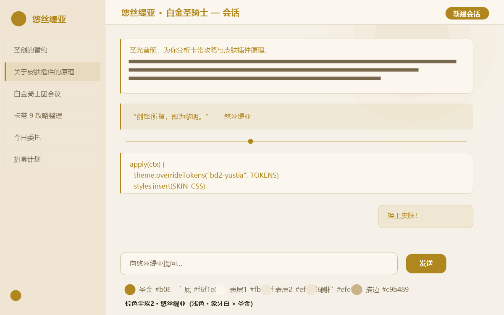
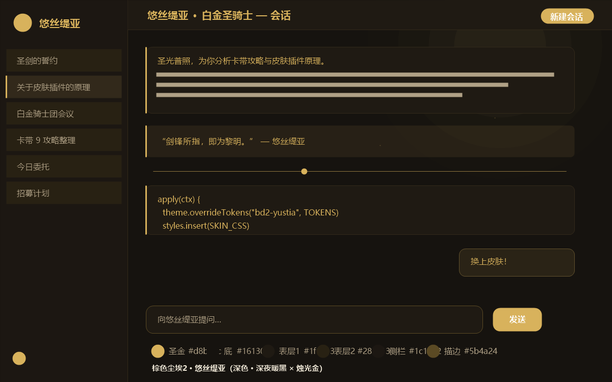

# 棕色尘埃2 · 悠丝缇亚 — DSH 皮肤插件

[](LICENSE)
[](https://github.com/deepseek-ai/deepseek-harness)

以《棕色尘埃2》(Brown Dust 2) 的圣剑骑士 **悠丝缇亚（Justia / ユースティア）** 为灵感的 DSH Web GUI 皮肤，昼夜双模式，纯展示层、可热插拔。

## 预览

| 浅色 · 象牙白 × 圣金 | 深色 · 深夜暖黑 × 烛光金 |
|---|---|
|  |  |

## 特性

- 浅色：暖象牙底 + 圣金主色（白金圣骑士）
- 深色：深夜暖黑 + 烛光金（烛火下的骑士团大厅）
- 签名装饰：圣光晕、星尘微光、金色滚动条/选中/链接/代码块/金色丝线分割线

---

## 一、hsr-kafka 皮肤插件原理（逆向分析）

参考仓库：<https://github.com/whyihaveyou/dsh-themes/tree/main/skins/hsr-kafka>

一个皮肤 = **一个自包含的 DSH 插件包**，由 5 层组成：

| 层 | 文件 | 作用 |
|---|---|---|
| 皮肤清单 | `skin.json` | 注册表元数据：`id`、`accent`、`bodyAttr`（CSS 作用域属性名）、`package`、`wiring.id`（插件行 ID）、预览图路径 |
| 组合补丁 | `cordis.patch.yml` | 把一个插件行 `ui-skin-hsr-kafka` insert 进 web 插件 roster（`dsh plugin add` 时由 bundle 机制消费） |
| 包契约 | `package.json` | `dsh.client.platform: "web"`、`dsh.bundle.patch` 指向补丁、入口 `./client` |
| Host 半体 | `src/index.ts` | 空实现（浏览器专用皮肤不提供宿主行为） |
| **Client 半体** | `src/client/index.ts` | 核心：挂载/回收皮肤表面 |
| **样式主体** | `src/client/hsr-kafka.module.css` | 全部 CSS 以 body 属性为作用域 |
| 契约测试 | `tests/apply.spec.ts` | 验证「apply 写入的一切在 dispose 时全部收回」 |

### Client 半体的三个动作（全部可逆）

```ts
export function apply(ctx: Context): void {
  const body = document.body
  body.dataset.dshHsrKafka = ''              // ① 挂上皮肤作用域属性
  const favicon = document.createElement('link') // ② 专属 favicon
  favicon.rel = 'icon'; favicon.href = `data:image/svg+xml;...`
  document.head.append(favicon)
  document.title = SKIN_TITLE                // ③ 专属标题
  ctx.effect(() => () => {                    // ④ 热插拔契约：dispose 全部收回
    delete body.dataset.dshHsrKafka
    favicon.remove()
    if (document.title === SKIN_TITLE) document.title = originalTitle
  })
}
```

### CSS 的昼夜双层作用域

- 浅色令牌挂 `body[data-dsh-hsr-kafka]`
- 深色令牌挂 `body[data-dsh-hsr-kafka][data-ds-dark-theme]`（外壳的日夜切换按钮直接生效）
- 重映射全套设计令牌：`--dsw-static-deepseek-*`、`--dsw-static-neutral-bluish-*`、`--dsw-alias-button-*`、`--dsw-specific-bubble/sidebar-*`、`--color-*`、`--bg-*` 等
- 签名纹理与动效：`body::before/::after` 蛛网/星尘图案 + `@keyframes`（web-sway、btn-sheen 等），作用域隔离不污染其他皮肤

**要点**：皮肤=纯展示插件（无 Service/Event/模型流量）；所有写入必须通过 `ctx.effect` 登记回收器，保证热插拔不残留。

---

## 二、本会话运行时的适配

本会话的动态 Cordis 插件运行时与 npm 皮肤包不同：

1. **无 `document`/`window` 内建符号** → 不能写 body 属性、favicon、标题，改为使用运行时原生能力：
   - `theme.overrideTokens(source, tokens)`：在活动主题上叠加一层 `{ light, dark }` 令牌对（本会话外壳正是消费 `--dsw-alias-*` / `--dsw-specific-*` 令牌的 DSW 体系，与 dsh-themes 同源），昼夜切换由主题系统负责，返回 disposer；
   - `styles.insert(css)`：包私有样式表注入，随 Client run 自动清理。
2. **不写死产品 DOM 选择器** → 装饰 CSS 只用 `body`、伪元素与通用内容元素（`a/code/pre/blockquote/hr`、`::selection`、滚动条），颜色一律 `var(--dsw-alias-*)` 引用令牌，昼夜自动跟随。
3. **可撤销性**：令牌层经 `ctx.effect` 登记、样式表由 `styles.insert` 管理，插件停止后全部收回。

对应关系：

| hsr-kafka (npm 包) | 本插件 (动态 Cordis) |
|---|---|
| CSS 模块重映射 `--dsw-*` | `theme.overrideTokens('bd2-yustia', { light, dark })` |
| 签名纹理 CSS（body 属性作用域） | `styles.insert(...)`（var() 令牌驱动，无需属性） |
| favicon / title | 不可用（无 document 内建符号），省略 |
| `ctx.effect` 回收 | `ctx.effect(() => overrideTokens(...))` + `styles.insert` 自动回收 |

---

## 三、调色板依据

悠丝缇亚（Justia）视觉参考：[GameKee 神圣悠丝缇亚](https://www.gamekee.com/zsca2/tj/626508.html)、[Gameline 角色页](https://gameline.jp/browndust2/characterlist/starfivelist/justia-status/)。对官方立绘采样得到的核心色：

- 象牙白 `#F0F0F0`（礼服主体）
- 圣金/古铜 `#D8C048`、`#786030`（金发、金饰与铠甲包边）
- 淡粉腮红 `#F0D8D8`
- 深炭 `#303030`（深色部件/描边）

由此设计：浅色=象牙白+圣金 `#b0871f`，深色=暖黑+烛光金 `#d8b25c`。

---

## 五、自定义背景图（动态插件 v5 能力）

### 背景库文件夹（推荐用法）

**位置：`D:\dsh_ai_workspace\bd2-yustia-skin\backgrounds\`**

**命名格式：`bg-<名称>.<扩展名>`**，例如：

- `bg-01-holy-light.jpg`（已内置示例）
- `bg-02.jpg`、`bg-星夜.png`、`bg-forest.webp` …

支持扩展名：`png / jpg / jpeg / webp / gif / avif / bmp / svg`（单文件 ≤ 8 MB）。

使用方式：把图片按上述格式放入文件夹 → 在 Run 卡片皮肤面板点「**刷新**」→ 下拉选择即自动应用（无需重载插件）。也可直接在输入框里填文件名（`bg-02` 或 `bg-02.jpg`，会自动匹配）。

### 其他输入方式

| 输入 | 行为 |
|---|---|
| 背景库文件名（`bg-02` / `bg-02.jpg`） | 自动解析到 `backgrounds/` 文件夹（Host `bg-list` 匹配） |
| 本地绝对路径或相对工作区路径 | Host `fs.readBytes` → base64 data URI（上限 8 MB） |
| `https://…` URL | 浏览器直连 CSS `url()`（背景图不受 CORS 限制；防盗链/CSP 拦截时请改用本地路径） |
| 「默认」按钮 | 恢复 `assets/default-bg.jpg` 圣光背景（挂载时自动应用） |
| 「移除」按钮 | 移除背景图，回到纯色皮肤 |

- 背景 CSS 自带一层 **50% 底色帷幕**（`color-mix(var(--dsw-alias-bg-base))`，昼夜自适应），保证文字可读；
- 启用背景时会同时把外壳 AppFrame 的不透明背景置透明（`body [class*='_frame']`），否则图片会被外壳容器完全遮挡；装饰层以高 z-index 浮于内容之上；
- 切换背景会先 dispose 上一张的样式表，停止插件时全部回收；
- ⚠️ 已知坑：动态插件宿主上下文里 `sandboxPolicy.workspaceRoot` 指向 DSH 宿主进程目录（本机为 `C:\Windows\System32`），**不是**会话工作区。Host 半体（`host.js`）因此使用固定会话工作区路径（`D:/dsh_ai_workspace`）；迁移机器/工作区时改这一处即可；
- 换默认图：把图片命名为 `bg-default.*` 放入 `backgrounds/`，或直接替换 `assets/default-bg.jpg`（16:9，≤ 8 MB）。

> 说明：静态皮肤包形态（`lib/`）保持基础皮肤能力；背景图交互依赖动态运行时的 `harness` RPC，仅动态插件提供。

---

## 六、交付物与用法

```
bd2-yustia-skin/
├── skin.json            # 皮肤清单（对齐 dsh-themes 格式，含 preview 路径）
├── client.js            # 动态运行时版 Client 半体源码（皮肤 + 背景图控制）
├── host.js              # 动态运行时版 Host 半体源码（背景文件读取 RPC）
├── yustia.module.css    # 签名装饰 CSS（独立文件版）
├── lib/index.js         # 静态包 Host 半体（空实现，已预构建）
├── lib/client.js        # 静态包 Client 半体（document 形态，基础皮肤能力）
├── assets/default-bg.jpg# 默认圣光背景图（16:9，可替换）
├── backgrounds/         # ★ 自定义背景库：bg-<名称>.<扩展名>，放入即用
│   └── bg-01-holy-light.jpg  # 示例背景
├── preview/light.png    # 浅色预览（脚本生成）
├── preview/dark.png     # 深色预览（脚本生成）
├── cordis.patch.yml     # 静态包组合补丁
├── package.json         # 静态包契约（dsh.client.platform: "web"）
├── LICENSE              # MIT 许可证
└── README.md            # 本文件
```

本皮肤已作为**动态 Cordis 插件**挂载进当前会话：插件运行时页面即生效，停止插件即恢复原主题。
运行时额外在 `cordis_run` 卡片内注册了皮肤信息面板（浅/深调色板一览，注册于 `tool.view.cordis` Slot、key `self`，随插件停止自动移除）。
静态皮肤包（`lib/` 预构建 + `cordis.patch.yml` + `package.json`）也已就绪，可用 dsh-themes 同款命令安装：
`dsh plugin --profile <你的profile> add ./bd2-yustia-skin`。
